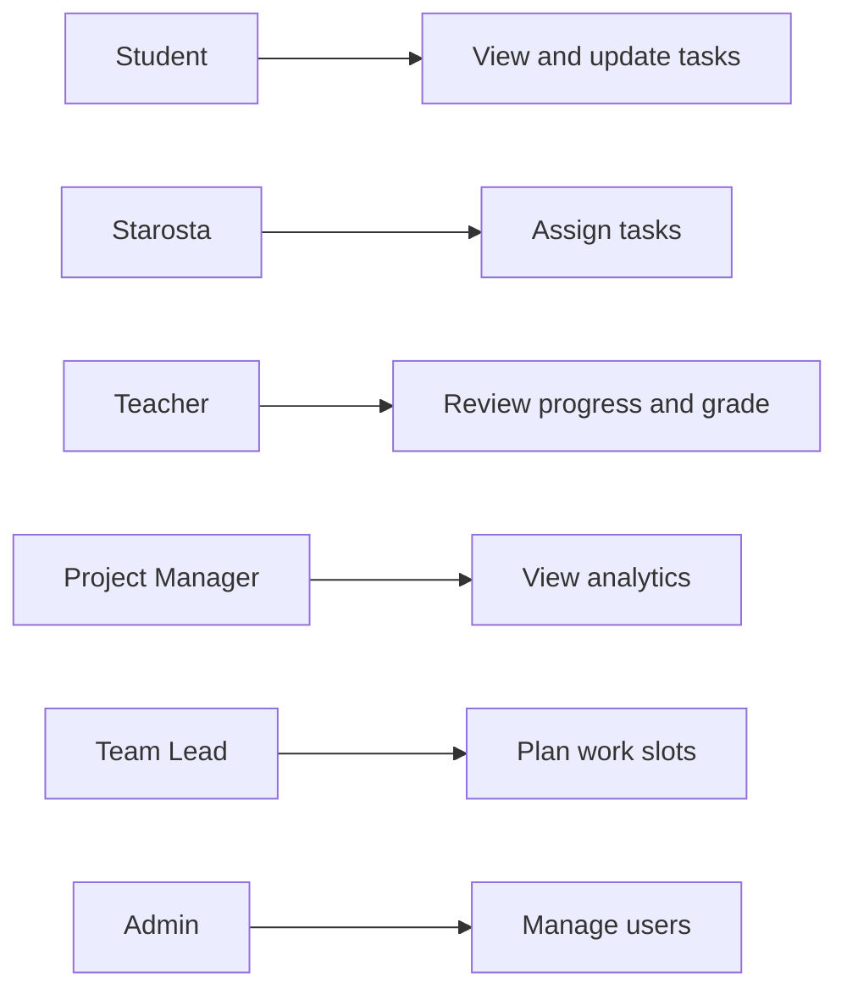
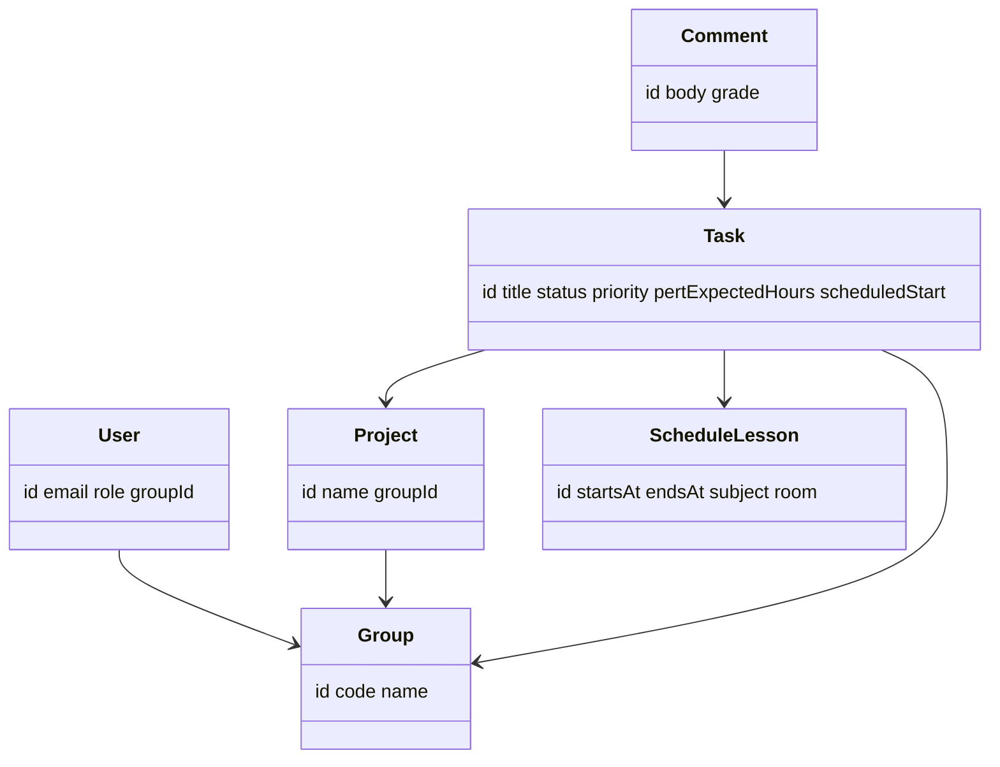
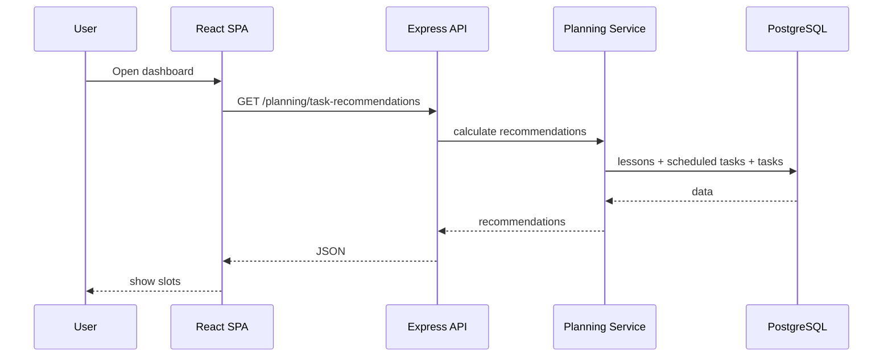
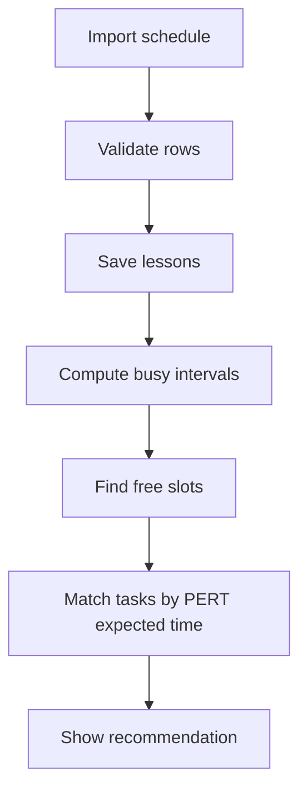
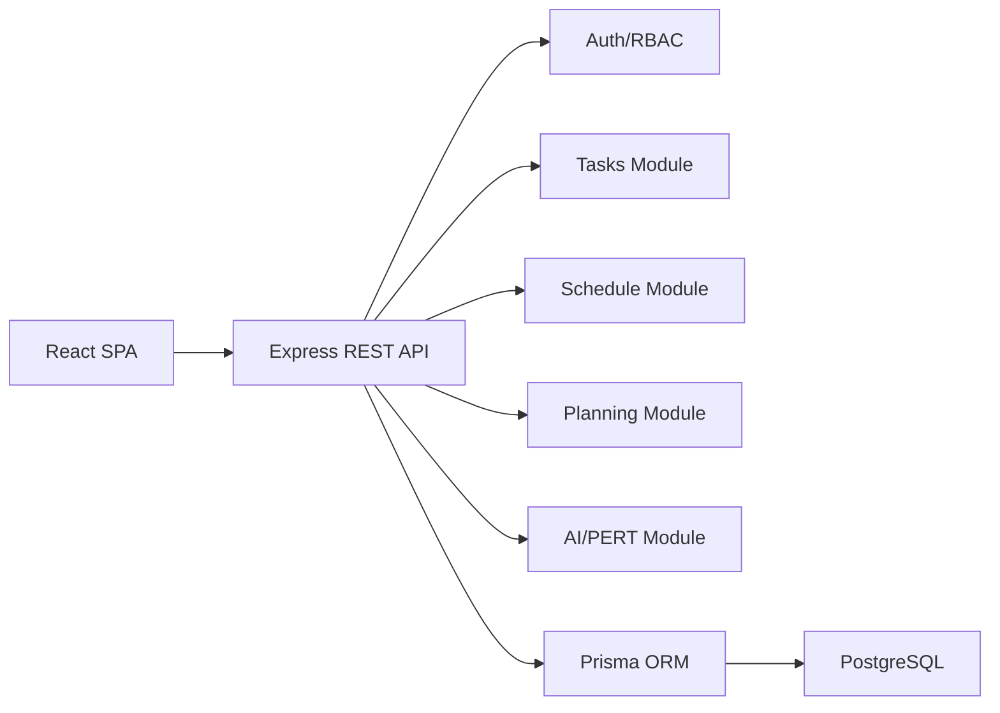
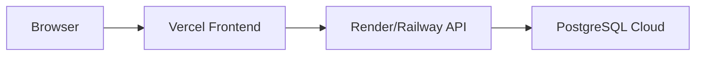

# Diagrams

## Use Case Diagram

```mermaid
flowchart LR
  Student["Student"] --> Board["View and update tasks"]
  Starosta["Starosta"] --> Assign["Assign tasks"]
  Teacher["Teacher"] --> Review["Review progress and grade"]
  PM["Project Manager"] --> Analytics["View analytics"]
  Lead["Team Lead"] --> Planning["Plan work slots"]
  Admin["Admin"] --> Users["Manage users"]
```

## Class Diagram

```mermaid
classDiagram
  class User { id email role groupId }
  class Group { id code name }
  class Project { id name groupId }
  class Task { id title status priority pertExpectedHours scheduledStart }
  class ScheduleLesson { id startsAt endsAt subject room }
  class Comment { id body grade }
  User --> Group
  Project --> Group
  Task --> Group
  Task --> Project
  Task --> ScheduleLesson
  Comment --> Task
```

## Sequence Diagram

```mermaid
sequenceDiagram
  participant U as User
  participant W as React SPA
  participant A as Express API
  participant P as Planning Service
  participant DB as PostgreSQL
  U->>W: Open dashboard
  W->>A: GET /planning/task-recommendations
  A->>P: calculate recommendations
  P->>DB: lessons + scheduled tasks + tasks
  DB-->>P: data
  P-->>A: recommendations
  A-->>W: JSON
  W-->>U: show slots
```

## Activity Diagram

```mermaid
flowchart TD
  A["Import schedule"] --> B["Validate rows"]
  B --> C["Save lessons"]
  C --> D["Compute busy intervals"]
  D --> E["Find free slots"]
  E --> F["Match tasks by PERT expected time"]
  F --> G["Show recommendation"]
```

## Component Diagram

```mermaid
flowchart LR
  Web["React SPA"] --> API["Express REST API"]
  API --> Auth["Auth/RBAC"]
  API --> Tasks["Tasks Module"]
  API --> Schedule["Schedule Module"]
  API --> Planning["Planning Module"]
  API --> AI["AI/PERT Module"]
  API --> Prisma["Prisma ORM"]
  Prisma --> DB["PostgreSQL"]
```

## Deployment Diagram

```mermaid
flowchart LR
  Browser["Browser"] --> Vercel["Vercel Frontend"]
  Vercel --> Render["Render/Railway API"]
  Render --> PG["PostgreSQL Cloud"]
```
