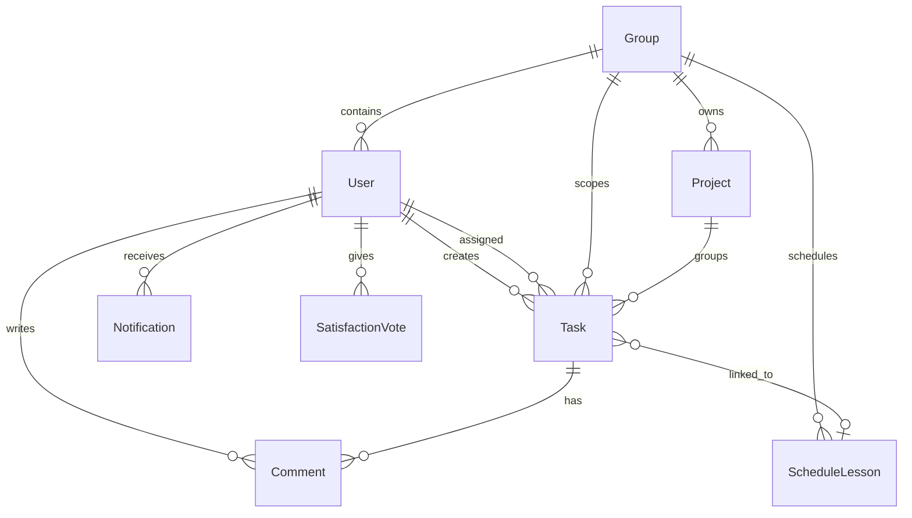

# ER Diagram

```mermaid
erDiagram
  User ||--o{ Task : creates
  User ||--o{ Task : assigned
  User ||--o{ Comment : writes
  Group ||--o{ User : contains
  Group ||--o{ Project : owns
  Group ||--o{ Task : scopes
  Group ||--o{ ScheduleLesson : schedules
  Project ||--o{ Task : groups
  Task ||--o{ Comment : has
  Task }o--o| ScheduleLesson : linked_to
  User ||--o{ Notification : receives
  User ||--o{ SatisfactionVote : gives
```
